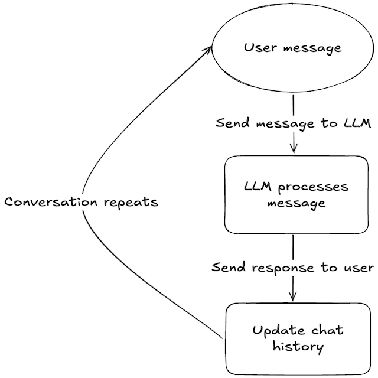

# 🧠 Memory-Powered Chatbot

This is a simple chatbot that takes in user messages and sends them to a large language model (LLM) for a response. The great feature of this chatbot is that it has *memory*, allowing it to remember previous messages throughout the conversation, which users can refer to.

## ✨ Features

- **Conversational Memory:** The chatbot can remember the conversation history.
- **LLM-Powered:** Utilizes a powerful language model for responses.
- **Streamlined Frontend:** Built with Streamlit for a quick and easy frontend interface.

## 🚀 How It Works

1. **User Input:** The user types a message, which gets displayed in the conversation.
2. **Processing with Langchain:** The chatbot sends the message, along with the conversation history, to the LLM via Langchain.
3. **LLM Response:** The LLM generates a response, which gets displayed in the conversation and saved in the memory.
4. **Memory Feature:** Throughout the conversation, the chatbot can recall and utilize previous messages to provide relevant context in responses.

## 🧰 Packages Used

- **🦜🔗 Langchain:** Langchain is used to handle sending messages to the model. It also provides the memory functionality, making the conversation flow more natural.
- **🤖 Streamlit:** Streamlit is used for the frontend, allowing us to focus on functionality without worrying about UI design.
- **🌍 Localtunnel:** Used to expose the chatbot running on a local machine to a public URL.

## 🏗️ The Architecture

Here’s a diagram that represents the architecture of the chatbot:




- **Frontend (Streamlit):** The user interacts with the chatbot via the Streamlit web app.
- **Backend (Langchain, OpenAI):** Langchain processes the messages and manages conversation memory. OpenAI's API is used to generate responses from the LLM.
- **Memory Management:** ConversationBufferMemory from Langchain is used to store and retrieve past conversations.
- **Local Deployment:** The app can be accessed locally or through a public URL using Localtunnel.

## 🔧 Setup Instructions

1. Clone the repository:
    ```bash
    git clone https://github.com/mundesamarth/langstream.git
    cd langstream
    ```

2. Install the required Python packages:
    ```bash
    pip install -r requirements.txt
    ```

3. Install Localtunnel (needed for exposing the app):
    ```bash
    npm install -g localtunnel
    ```

4. Create a `.env` file to store your API key:
    ```
    OPENAI_API_KEY=your-api-key-here
    ```

5. Run the app:
    ```bash
    streamlit run app.py
    ```

6. Use Localtunnel to expose the app to the web (optional):
    ```bash
    npx localtunnel --port 8501
    ```
